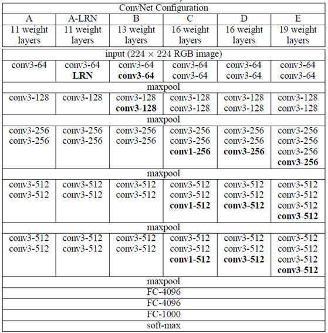

# VERY DEEP CONVOLUTIONAL NETWORKS  
# FOR LARGE-SCALE IMAGE RECOGNITION  
  
### VGGNet 요약
* VGGNet은 옥스포드 대학의 연구팀 VGG에 의해 개발된 모델
* 모든 필터 커널의 사이즈를 줄이고 대신 네트워크의 깊이를 깊게 하여 computation time을 줄이고 accuracy를 향상시킴을 증명함
* 2014년 ImageNet 인식 대회에서 준우승  
  
  
### 1. INTRODUCTION
* Objective: investigate the effect of the convolutional network depth on its accuracy in the large-scale image recognition setting
  
  
### 2 CONVNET CONFIGURATIONS
### 2.1 ARCHITECTURE

* Dataset: ILSVRC-2012 dataset
* Preprocessing: subtracting the mean RGB value, computed on the training set, from each pixel
* Convolutional (conv.) layers with a very small receptive field: 3 × 3    * which is the smallest size to capture the notion of left/right, up/down, center

### 2.2 CONFIGURATIONS

Table#1.png

### 3. Evaluation
### 3.1 Single Scale Evaluation

Table#3.png

* layers with a single 5×5 conv. layer (which has the same receptive field as explained in Sect. 2.3). The top-1 error of the shallow net was measured to be 7% higher than that of B (on a center crop), which confirms that a deep net with small filters outperforms a shallow net with larger filters
* Classification error decreases with the increased ConvNet depth: from 11 layers in A to 19 layers in E
* Local response normalisation (A-LRN network) does not improve on the model A without any normalisation layers
* Additional non-linearity does help (C is better than B)
* It is also important to capture spatial context by using conv. filters with non-trivial receptive fields (D is better than C)
* Finally, scale jittering at training time (S ∈ [256; 512]) leads to significantly better results than training on images with fixed smallest side (S = 256 or S = 384), even though a single scale is used at test time

### 3.2 Multi-Scale Evaluation

Table#4.png

* Scale jittering at test time leads to better performance

### 3.3 Multi-crop Evaluation

Table#5.png

* Using multiple crops performs slightly better than dense evaluation
* Two approaches are indeed complementary, as their combination outperforms each of them

### 3.4 CONVNET FUSION

Table#6.png

### 3.5 COMPARISON WITH THE STATE OF THE ART

Table#7.png

### 4. Discussion

* What have we gained by using a stack of three 3×3 conv. layers instead of a single 7×7 layer? 

* First, makes the decision function more discriminative

* Second, decrease the number of parameters
   * Assume: that both the input and the output of a three-layer 3 × 3 convolution stack has C channels, The stack is parametrised by  weights
   * 7 × 7 conv. layer:  parameters, I.e. 81% more

